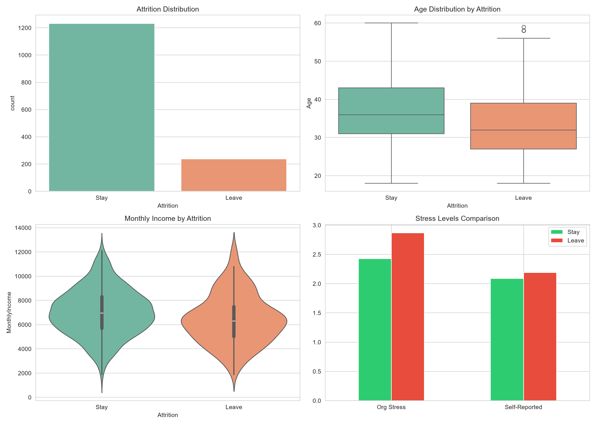
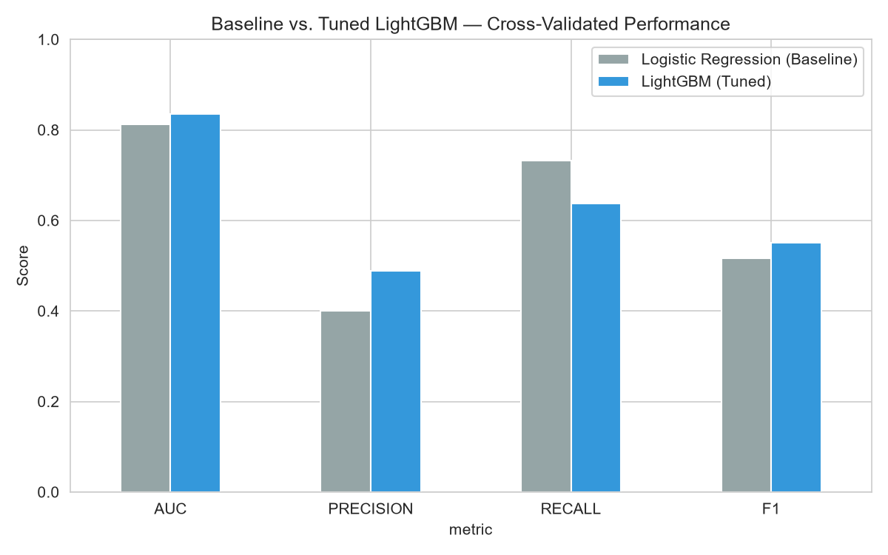
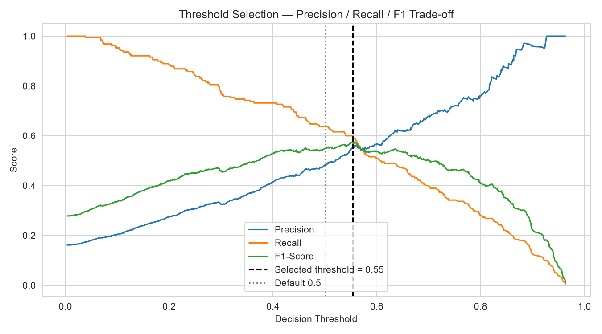
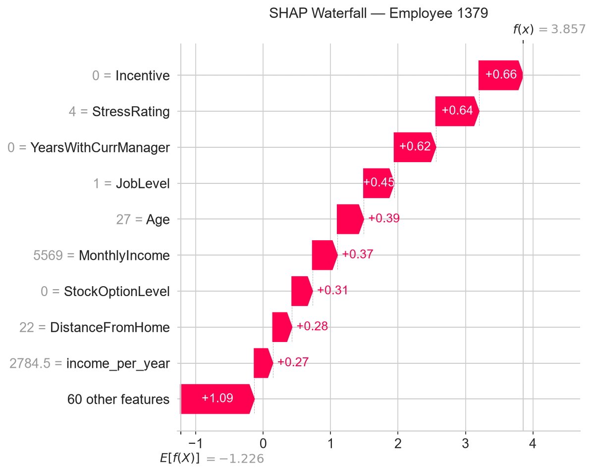

# no_caps_bro
An ML based business proposal for optimizing HR retention strategies: A data-driven HR analytics project leveraging Machine Learning to predict employee attrition and formulate retention strategies for an IT consulting firm
# HR Attrition Prediction & Retention ROI - Company I

This project builds a machine learning pipeline that predicts employee attrition and turns the model's output into a retention program with a projected ROI. It was built as a consulting-style deliverable for a fictional client, "Company I," an IT services firm dealing with high turnover.

## Why this project

Company I loses employees at a rate that costs it real money: lost billable hours, disrupted client work, and a slow replacement search every time someone leaves. The brief was to act as a new associate at a consulting firm and turn Company I's HR records into something leadership could actually use, not just a model with a good accuracy score.

That meant the project had to go further than training a classifier. It needed a model that flags which employees are at risk and explains why in terms an HR person can act on, a decision threshold chosen for the actual business trade-off instead of the default 0.5, and a retention program costed out well enough that a CFO could poke holes in it and re-run the numbers themselves.

## What's in the notebook

- Exploratory analysis comparing employees who stayed against those who left, on income, age, stress, and workload, before any model is trained.
- Feature engineering based on how HR actually reasons about risk: tenure buckets, the gap between self-reported and organizational stress, income normalized by experience, a satisfaction composite, and an overtime-by-stress interaction.
- A preprocessing pipeline that's fit only on the training split, so nothing about the test set leaks into imputation, scaling, or the one-hot categories.
- A Logistic Regression baseline first, so the extra complexity of LightGBM has to earn its place.
- Hyperparameter tuning with Optuna, seeded so the same run gives the same parameters, threshold, and ROI numbers every time.
- A decision threshold picked from the Precision-Recall curve on out-of-fold predictions, since the default 0.5 cutoff is a bad fit for a dataset where only about 16% of employees leave.
- SHAP explanations at both the global level and per employee, with the per-employee values shown in their real units (job level, stress rating, income) instead of the scaled numbers the model actually trains on.
- Risk tiers built around the model's own threshold rather than arbitrary round numbers, so nobody the model actually flags ends up sitting in the "Low Risk" bucket.
- A financial simulation for a targeted retention program, including sensitivity tables (effectiveness and replacement cost) and a break-even point, rather than one number presented as fact.

## Preview

A few of the figures the notebook produces, from a sample run, so you can see what comes out before opening anything.

**Who's leaving, and how they differ from who stays:**



**Whether the tuned LightGBM model actually beats the simple baseline:**



**Where the decision threshold gets picked, and why 0.5 wouldn't have worked here:**



**What drives one specific employee's risk score, in real units:**



The other two figures (`shap_summary.png`, `shap_importance.png`) cover global feature importance across all employees rather than one individual, and sit in Section 8 of the notebook.

## Results

The exact numbers move a little each time Optuna re-tunes the model (though the run is seeded, so repeat runs on the same data reproduce the same result). Rather than freeze a number here that could go stale, treat the "Executive Recap" cell at the end of Section 10 as the source of truth. Copy from there into any slide deck or report.

What stays consistent run to run: LightGBM beats the Logistic Regression baseline, the tuned threshold sits well below 0.5 given the class imbalance, and the retention program's Net ROI is comfortably positive even under the more conservative effectiveness assumptions in the sensitivity table.

## Repository layout

```
.
├── no_caps_bro.ipynb   main notebook, run this top to bottom
├── dataset/
│   └── data.csv        HR dataset used in the analysis
├── artifacts/           figures the notebook generates, also shown above
└── README.md
```

`data.csv` is included in this repo. It's a modified, synthetic version of the public IBM HR Analytics dataset rather than Company I's real records, so there's nothing sensitive about shipping it alongside the code. If you swap in your own data, keep it at that same path; the notebook reads from `dataset/data.csv` and will raise a clear error if the file isn't there.

## Setup

Needs Python 3.10 or newer and Jupyter.

```
pip install pandas numpy matplotlib seaborn scikit-learn lightgbm optuna shap jupyter
```

Or with a requirements file:

```
pandas
numpy
matplotlib
seaborn
scikit-learn
lightgbm
optuna
shap
jupyter
```

## Running it

1. Clone the repo.
2. Open the notebook: `jupyter notebook no_caps_bro.ipynb`
3. Restart the kernel and run all cells, in order. There's no hidden state and no Colab-specific paths, so this works the same on any machine.
4. It takes a few minutes. The Optuna search is capped on purpose (`OPTUNA_N_TRIALS = 30`, `OPTUNA_TIMEOUT_SECONDS = 180` in Section 1) so the notebook finishes quickly instead of chasing marginal gains.
5. Everything is seeded (`RANDOM_STATE = 42`, including Optuna's sampler), so re-running gives the same result every time.
6. Take the numbers from the "Executive Recap" print block at the end of Section 10 and copy them into the summary at the top of the notebook, or into a slide deck.

## How the notebook is organized

| Section | Content |
|---|---|
| 1 | Setup, logging, seeding, and every tunable assumption in one place |
| 2 | Load the data, encode the target, drop constant/identifier columns, build a data dictionary |
| 3 | Exploratory analysis: class balance, income/age/stress by attrition, top correlations |
| 4 | Feature engineering and the leak-safe preprocessing pipeline |
| 5 | Logistic Regression baseline |
| 6 | LightGBM with Optuna tuning and early stopping |
| 7 | Threshold selection from the Precision-Recall curve |
| 8 | SHAP: global importance and per-employee explanations |
| 9 | Risk tiers anchored to the model's threshold |
| 10 | ROI simulation, with sensitivity tables and a break-even point |
| 11 | Conclusion and recommendations for Company I |

A few cells are marked as business insight prompts and left partly open on purpose. They're meant to be filled in after looking at that run's actual plots and numbers, not pre-written.

## Reading the output

Start with Section 3 before looking at the model at all; the correlation list and comparison plots set up the hypotheses the model either confirms or complicates. In Section 6/7, the baseline-vs-tuned comparison shows whether LightGBM's extra complexity was worth it, and the threshold plot shows where precision and recall actually cross, which is a more useful way to pick a cutoff than defaulting to 0.5.

The SHAP section is meant to be read almost like notes before an HR conversation: the summary plot ranks what matters across all employees, and the waterfall plot for the highest-risk employee breaks down their specific top five factors in real units.

In Section 9, the crosstab of predicted label against risk tier is worth checking directly. It confirms that no one the model actually flags as likely to leave has ended up in the Low Risk bucket, which would otherwise undercut the whole point of the tiers.

For the ROI section, don't quote the single Net ROI figure on its own. The sensitivity tables right below it show how that number changes if the program turns out less effective than assumed, or if the true replacement cost differs from the benchmark used, and the break-even line marks the point below which the program stops making financial sense.

## A few terms, if you're skimming this without an ML background

**SHAP** breaks a single prediction down into how much each input pushed it up or down, so instead of "this employee is 90% likely to leave" you get "this employee is 90% likely to leave, and here are the five reasons why, in order." That's what makes Section 8 useful to someone in HR rather than just to whoever built the model.

**Optuna** searches over model settings (tree depth, learning rate, and so on) to find a combination that performs well on held-out data, instead of the analyst guessing at reasonable values by hand.

**LightGBM** is the actual model doing the predicting: a gradient-boosted tree ensemble, generally strong on tabular data like this HR dataset. It's compared against a plain Logistic Regression baseline in Section 5 to check that the added complexity is actually buying something.

**The decision threshold** is the probability cutoff above which someone gets labeled "likely to leave." The obvious choice is 50%, but with only about 16% of employees actually leaving, 50% turns out to flag almost nobody. Section 7 picks a better cutoff by looking at where precision and recall trade off against each other.

**The ROI simulation** takes the employees the model flags, estimates what it costs to lose and replace them, and compares that against the cost of a retention program aimed at that group. Section 10 covers where each number in that calculation comes from.

## Assumptions worth knowing before presenting this externally

The dataset is a modified version of the public IBM HR Analytics set, not Company I's actual records, so this is a proof of concept, not a production forecast. The replacement cost multiplier, program cost per employee, and assumed effectiveness in Section 1 are estimates based on general industry figures, not Company I's real financials; they're kept as named constants at the top specifically so someone can challenge them and re-run with different numbers in seconds. And the ROI simulation is a projection from the model's probabilities, not a measured outcome from an actual program, which is why it's reported as a range with a break-even point rather than one confident total.

## If something doesn't run

Most issues come down to one of a few things: the notebook wasn't run top to bottom (later sections depend on variables set earlier, so skipping around breaks it), a package is missing (`pip install` the list under Setup), or LightGBM fails to build from source on an unusual platform, in which case installing via conda (`conda install -c conda-forge lightgbm`) is usually more reliable than pip. Optuna prints a lot by default; that's muted in Section 1, so if you see a wall of trial-by-trial logs, check that cell actually ran.

## Deliverables for this assignment

This notebook covers the technical deliverable. Still to produce: the executive presentation (up to 15 pages, PDF), built from this notebook's EDA figures, model metrics, and the Section 10 ROI breakdown, and the reference list for market research sources and any AI chat history used along the way.

## License

MIT, see [LICENSE](LICENSE).
